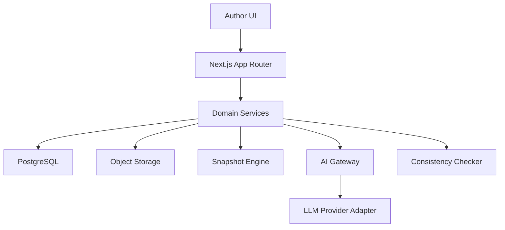
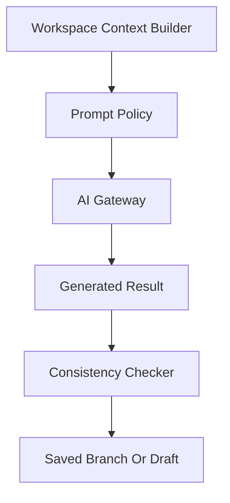

# Novel AI Writing Platform

Feature Name: novel-ai-writing-platform
Updated: 2026-05-07

## Description

本方案采用 `Next.js` 全栈架构，面向单人或小团队小说创作场景，优先满足创作流畅度、设定一致性和图谱可视化体验。整体设计把“作品”作为顶层聚合根，将角色、章节、世界观、场景、势力和各类关系状态纳入统一的数据模型与快照系统中。AI 能力通过可替换模型网关接入，避免业务层与单一模型供应商强耦合。

## Architecture

### Logical Layers

- `app` 层: 负责页面路由、服务端动作入口、鉴权边界和首屏数据装配。
- `domain` 层: 负责作品、角色、章节、场景、世界观、势力、快照和 AI 生成的核心业务规则。
- `infra` 层: 负责数据库、对象存储、AI 供应商适配器、全文搜索和导出实现。
- `ui` 层: 负责编辑器、2D 图谱、检索面板、版本回溯视图和护眼主题。

## Components and Interfaces

### 1. Work Management

- `WorkService`
- 责任: 创建作品、切换作品、隔离数据域、汇总作品级仪表盘。
- 关键接口:
  - `createWork(input)`
  - `listWorks(userId)`
  - `archiveWork(workId)`

### 2. Character Module

- `CharacterService`
- 责任: 管理角色档案、立绘、标签、版本历史。
- 关键接口:
  - `createCharacter(workId, payload)`
  - `updateCharacter(characterId, patch)`
  - `generateBiography(characterId)`
  - `searchCharacters(workId, query)`

### 3. Chapter and Writing Module

- `ChapterService`
- `WritingEditorService`
- 责任: 管理章节正文、正文版本、定点续写、平行剧情分支。
- 关键接口:
  - `createChapter(workId, payload)`
  - `saveChapterDraft(chapterId, content)`
  - `generatePlotBranches(chapterId, cursorRange)`
  - `savePlotBranch(chapterId, branchPayload)`

### 4. Relationship Graph Module

- `CharacterRelationService`
- `FactionRelationService`
- 责任: 维护章节级关系状态、节点布局、边样式和历史回溯。
- 建议实现:
  - 使用 `React Flow` 承载 2D 节点图。
  - 节点数据与章节状态解耦存储，避免覆盖其他章节。

### 5. Scene Sandbox Module

- `SceneService`
- `SceneLayoutService`
- 责任: 管理全局场景库与章节场景分布图。
- 关键接口:
  - `createScene(workId, payload)`
  - `reuseScene(sceneId, chapterId)`
  - `updateCharacterPosition(chapterId, positionPatch)`

### 6. World Knowledge Base Module

- `LoreService`
- `LoreSearchService`
- 责任: 管理世界观词条、关联、引用与冲突检查。
- 关键接口:
  - `createLoreEntry(workId, payload)`
  - `linkLoreEntries(sourceId, targetId, relationType)`
  - `searchLore(workId, query)`
  - `checkLoreConflicts(workId, candidateEntry)`

### 7. Faction Module

- `FactionService`
- 责任: 管理势力档案、组织结构、章节事件和关系变迁。
- 关键接口:
  - `createFaction(workId, payload)`
  - `updateFactionHierarchy(factionId, hierarchy)`
  - `recordFactionEvent(chapterId, eventPayload)`

### 8. Snapshot and Restore Module

- `SnapshotService`
- 责任: 提供对象级与作品级快照保存、比较与回退。
- 关键接口:
  - `createSnapshot(scope, targetId, note)`
  - `listSnapshots(scope, targetId)`
  - `restoreSnapshot(snapshotId)`
  - `diffSnapshot(snapshotId, compareToId)`

### 9. Export Module

- `ExportService`
- 责任: 导出正文、档案、设定和图谱图像。
- 输出形式:
  - 正文: `docx` 或 `markdown`
  - 设定: `pdf` 或 `markdown`
  - 图谱: `png` 或 `svg`

### 10. AI Gateway

- `AiGatewayService`
- `PromptContextBuilder`
- `ConsistencyCheckService`
- 责任: 统一组装上下文、调用模型、校验输出、记录可追溯元数据。
- 关键接口:
  - `generateCharacterBiography(characterId)`
  - `generatePlotBranches(chapterId, promptMode)`
  - `continueAtCursor(chapterId, cursorRange)`
  - `validateGeneratedContent(workId, generatedText, contextRefs)`

## Data Models

### Core Entities

- `Work`
  - `id`, `title`, `genre`, `summary`, `theme`, `createdBy`, `createdAt`, `updatedAt`
- `Character`
  - `id`, `workId`, `name`, `appearance`, `personality`, `backstory`, `habits`, `catchphrase`, `weakness`, `mission`, `taboo`, `arc`, `avatarAssetId`, `biography`, `status`
- `Chapter`
  - `id`, `workId`, `title`, `orderIndex`, `content`, `status`, `timelineNote`, `createdAt`, `updatedAt`
- `PlotBranch`
  - `id`, `chapterId`, `branchName`, `sourceRange`, `content`, `createdBy`, `createdAt`
- `Scene`
  - `id`, `workId`, `name`, `environment`, `residentCharacters`, `foreshadowing`, `weather`, `timeSetting`, `dangerZones`
- `LoreEntry`
  - `id`, `workId`, `category`, `title`, `summary`, `content`, `tags`, `conflictStatus`
- `Faction`
  - `id`, `workId`, `name`, `stance`, `doctrine`, `hierarchyJson`, `summary`

### Chapter State Entities

- `ChapterCharacterRelationState`
  - `id`, `chapterId`, `sourceCharacterId`, `targetCharacterId`, `relationType`, `intimacyLevel`, `conflictLevel`, `note`
- `ChapterFactionRelationState`
  - `id`, `chapterId`, `sourceFactionId`, `targetFactionId`, `relationType`, `intensityLevel`, `note`
- `ChapterScenePlacement`
  - `id`, `chapterId`, `sceneId`, `characterId`, `x`, `y`, `stateNote`
- `GraphLayout`
  - `id`, `chapterId`, `graphType`, `layoutJson`

### Platform Support Entities

- `Asset`
  - `id`, `workId`, `type`, `storageKey`, `mimeType`, `width`, `height`
- `Snapshot`
  - `id`, `workId`, `scopeType`, `targetId`, `snapshotJson`, `createdBy`, `createdAt`, `summary`
- `AiGenerationRecord`
  - `id`, `workId`, `moduleType`, `targetId`, `provider`, `model`, `promptDigest`, `resultDigest`, `status`, `createdAt`
- `ConflictRecord`
  - `id`, `workId`, `sourceType`, `sourceId`, `conflictType`, `message`, `referenceJson`, `createdAt`

## Correctness Properties

1. 任何角色、章节、场景、世界观和势力记录都必须归属于且只归属于一个 `Work`。
2. 任一章节的人物关系状态与势力关系状态必须独立存储，不得直接覆盖其他章节的状态。
3. AI 生成结果在进入正式正文或正式档案前必须经过一致性校验。
4. 快照恢复必须是显式用户操作，且恢复前必须保留当前状态的可回退入口。
5. 图谱节点布局与业务关系数据应分离存储，避免拖拽布局导致关系语义变化。

## Error Handling

### AI Errors

- 模型超时: 返回可重试提示，并保留当前编辑状态。
- 模型响应为空: 记录失败状态并允许用户重新生成。
- 模型输出冲突: 返回冲突说明、关联设定来源和建议修正方向。

### Persistence Errors

- 草稿保存失败: 在前端保留本地暂存，并提示用户重新同步。
- 快照恢复失败: 不覆盖当前数据，并保留错误日志与恢复说明。
- 资源上传失败: 保留原角色数据，允许用户重新上传头像或立绘。

### Validation Errors

- 角色关键字段不足: 拒绝触发小传生成并高亮缺失字段。
- 场景空间冲突: 允许保存草稿，但将冲突标记为待处理。
- 世界观冲突: 允许用户查看冲突详情后决定是否强制保存。

## Test Strategy

### Unit Tests

- `CharacterService` 字段保存与版本比较。
- `PromptContextBuilder` 上下文拼装完整性。
- `ConsistencyCheckService` 对角色设定冲突、世界观冲突和关系冲突的检测规则。
- `SnapshotService` 的创建、差异比较与恢复逻辑。

### Integration Tests

- 创建作品后全链路创建角色、章节、场景、世界观和势力。
- 某章节内修改人物关系后，验证其他章节状态不受影响。
- AI 生成剧情后写入剧情分支，再执行冲突校验与版本保存。
- 导出整部作品时，验证正文、设定和图谱文件完整输出。

### End-to-End Tests

- 用户从新建作品到完成一章创作的完整流程。
- 用户在关系图中拖拽节点、修改关系、回溯历史章节。
- 用户上传角色头像、触发小传生成、编辑后保存。
- 用户在护眼模式下使用编辑器和图谱模块的主要交互流程。

## Suggested Implementation Choices

- 前端框架: `Next.js` with App Router。
- 数据库: `PostgreSQL`。
- ORM: `Prisma`。
- 富文本编辑器: `TipTap` 或同级可扩展编辑器。
- 图谱引擎: `React Flow`。
- 检索: 初期可用数据库全文检索，后续升级专用搜索服务。
- 对象存储: `S3` 兼容存储。
- 队列: AI 生成与导出建议通过异步任务队列执行。

## Delivery Phases

1. Phase 1: 作品、角色、章节编辑器、世界观词条、基础导出。
2. Phase 2: 人物关系图、场景分布图、势力体系图、章节状态回溯。
3. Phase 3: AI 小传、剧情分支、设定冲突检测、快照系统。
4. Phase 4: 高级一致性检查、导出增强、协作能力与性能优化。

## References

[^1]: (Filename#L1) - 需求来源于用户在本次对话中提供的平台功能说明 `conversation`。
