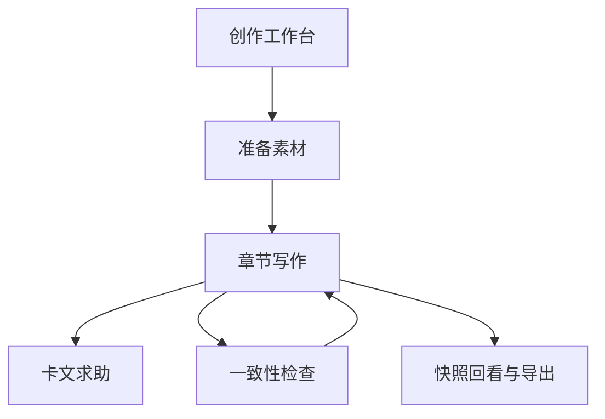
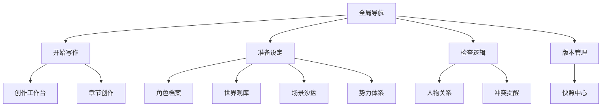

# PlotForge Writing Workflow Redesign

Feature Name: plotforge-writing-workflow-redesign
Updated: 2026-05-07

## Description

本次重构不把 PlotForge 继续当成“角色页、关系页、世界观页”的并列式工具箱，而是把 PlotForge 重新定义为围绕小说作者真实创作路径运行的工作台。核心逻辑如下：

1. 作者先明确当前作品与当前创作阶段。
2. 作者通过角色、设定、关系、场景等模块准备创作上下文。
3. 作者在章节创作中进入正文写作，并在卡文时请求 AI 帮助。
4. 作者在创作过程中持续检查一致性风险。
5. 作者在必要时回看快照、导出内容或回退历史。

因此，界面和交互需要服务于“下一步写什么”和“怎么保证不写崩”这两个核心问题。

## Architecture

## Components and Interfaces

### 1. 创作工作台重构

- 目标: 让首页回答“现在写到哪里了”“当前有什么风险”“下一步建议去哪”。
- 布局建议:
  - 顶部: 当前作品、阶段、进度摘要、继续写作按钮。
  - 中部左侧: 推荐写作路径与快捷入口。
  - 中部右侧: 人设/设定/关系风险卡片。
  - 底部: 最近章节、核心角色、最近 AI 记录、其他作品。

### 2. 全局导航重构

- 一级逻辑分组:
  - 开始写作: `工作台`、`章节创作`
  - 准备设定: `角色档案`、`世界观库`、`场景沙盘`、`势力体系`
  - 检查逻辑: `人物关系`
  - 版本管理: `快照中心`
- 每项提供一句用途说明，降低首次理解成本。

### 3. 首访引导组件

- `OnboardingGuide`
- 责任:
  - 在首页展示推荐使用顺序。
  - 在用户关闭后只保留轻入口，不反复打扰。
- 建议内容:
  - 第一步: 先补角色和世界观。
  - 第二步: 建章节目标并开始写正文。
  - 第三步: 卡文时再调用 AI 分支与续写。
  - 第四步: 用关系图和快照检查是否写崩。

### 4. 章节创建流程优化

- 章节创建不是简单新增一条记录，而是写作动作的起点。
- 创建弹窗应至少包含:
  - 章节标题
  - 本章目标 / 核心钩子
  - 可选的写作意图提示
- 创建后进入正文编辑器，并将“章节目标”放在近处。

### 5. 模块页头说明统一

- 每个模块页头包含:
  - 当前模块名称
  - 一句“这个模块解决什么写作问题”的说明
  - 推荐下一步操作
- 用统一的 `module-intro` 视觉结构表达。

## Data Models

本次重构主要调整前端交互语义，不新增后端持久化实体。可补充前端会话态:

- `OnboardingState`
  - `dismissedAt`, `lastStepViewed`
- `WritingWorkspaceState`
  - `activeWorkId`, `recommendedNextAction`, `currentRiskCount`

## Correctness Properties

1. 首页信息层级必须优先服务于“继续写作”和“发现风险”，而非平均展示全部模块。
2. 导航分组必须稳定，不能让同级功能在不同页面表现出冲突的信息架构。
3. 新手引导必须可关闭且可再次查看，不能长期阻断主要创作流程。
4. 章节创建流程必须先收集最小写作意图，再进入正文编辑器。
5. 模块页头说明必须与模块真实用途一致，不能仅停留在抽象名词层面。

## Error Handling

### 首访引导

- 若本地状态读取失败，则默认展示一次引导。
- 若用户关闭引导，则保留“重新查看引导”入口。

### 章节创建

- 若标题为空，则回退为默认章节标题。
- 若用户未填写章节目标，则允许继续，但给出轻量提示说明可稍后补充。

## Test Strategy

- 手工验证首页信息结构是否清晰。
- 手工验证导航分组与跳转是否正确。
- 手工验证首访引导显示、关闭、再次打开流程。
- 手工验证章节创建弹窗输入、创建与跳转。
- 运行 `npm run lint` 与 `npm run build` 验证构建稳定性。
